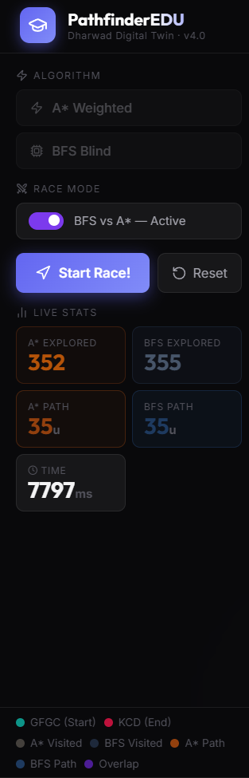
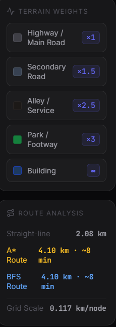
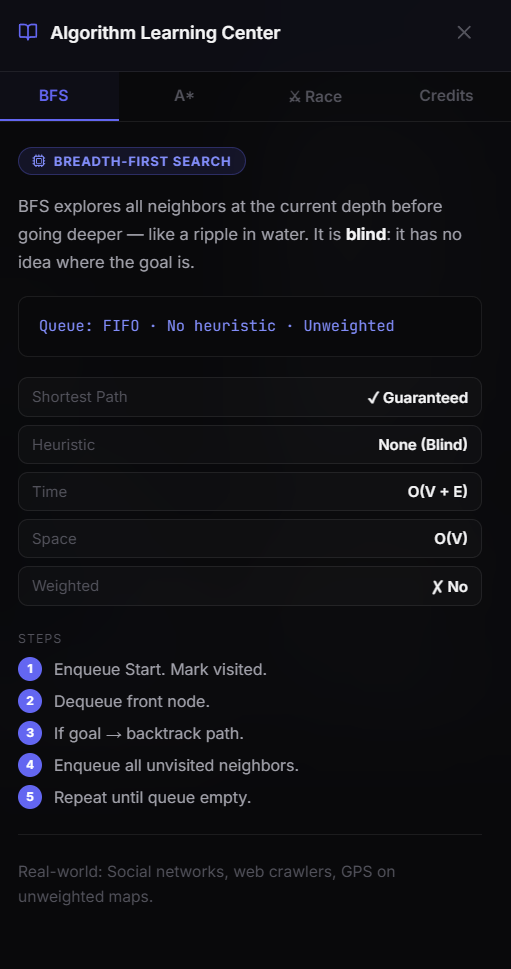

# PathfinderEDU

### Interactive 3D Pathfinding Simulation
#### Visualizing BFS and A* Search Algorithms on Real-World Map Data


---

## Overview

**PathfinderEDU** is a 3D pathfinding visualizer that demonstrates BFS and A* search algorithms on a real-world map of Dharwad, Karnataka. The simulation navigates between two actual college campuses:

| Location | Coordinates |
|---|---|
| GFGC College, Kumareshwarnagar | 15.4707 N, 74.9916 E |
| KCD Arts College, Dharwad | 15.4530 N, 74.9980 E |

The 3D grid is overlaid on Google Satellite imagery with procedurally generated buildings and road corridors. Users can place and remove walls, then watch BFS or A* navigate the city in real time.

---

## Screenshots

**Race Mode — BFS vs A* running simultaneously**


**Left Panel — Algorithm controls and live stats**



**Right Panel — Terrain weights and route analysis**



**Algorithm Learning Center — BFS theory with pseudocode**



---

## Algorithms

### Breadth-First Search (BFS)

BFS is an uninformed, exhaustive graph traversal algorithm. It explores all nodes at the current depth before moving deeper — like a ripple spreading outward from a point.

```
Algorithm BFS(Grid, Start, End):
  Initialize Queue Q
  Enqueue Start, mark as visited

  While Q is not empty:
    current = Q.dequeue()
    If current == End: return path via parent pointers
    For each unvisited neighbor of current:
      Mark as visited, set parent = current
      Q.enqueue(neighbor)

  Return "No path found"
```

| Property | Value |
|---|---|
| Completeness | Guaranteed |
| Optimality | Shortest path (unweighted graphs) |
| Time Complexity | O(V + E) |
| Space Complexity | O(V) |
| Data Structure | Queue (FIFO) |
| Heuristic | None |

---

### A* Search

A* is an informed, heuristic-guided algorithm. It combines the actual cost to reach a node `g(n)` with an estimated cost to the goal `h(n)`, always expanding the most promising node first.

```
f(n) = g(n) + h(n)

g(n) = actual cost from Start to n
h(n) = Manhattan distance from n to End
f(n) = total estimated path cost through n
```

```
Algorithm A*(Grid, Start, End):
  Open List (Priority Queue) = { Start }
  g(Start) = 0

  While Open List is not empty:
    current = node with lowest f(n)
    If current == End: reconstruct and return path

    For each neighbor of current:
      tentative_g = g(current) + terrain_weight(neighbor)
      If tentative_g < g(neighbor):
        neighbor.parent = current
        g(neighbor) = tentative_g
        f(neighbor) = g(neighbor) + h(neighbor)
        Add to Open List

  Return "No path found"
```

| Property | Value |
|---|---|
| Completeness | Guaranteed |
| Optimality | Guaranteed with admissible heuristic |
| Time Complexity | O(E log V) |
| Space Complexity | O(V) |
| Data Structure | Priority Queue |
| Heuristic | Manhattan Distance |

---

### BFS vs A* Comparison

| Criterion | BFS | A* |
|---|---|---|
| Search Style | Exhaustive | Guided |
| Nodes Explored | High | Low |
| Speed | Slower | Faster |
| Shortest Path | Yes | Yes |
| Weighted Graphs | No | Yes |
| Heuristic | None | Manhattan Distance |
| Real-world Use | Web crawlers, social graphs | GPS navigation, game AI |

In this simulation, A* typically explores 30-60% fewer nodes than BFS to find the same optimal path.

---

## Terrain Weights

A* uses real road-type data from OpenStreetMap to assign movement costs:

| Terrain | Weight |
|---|---|
| Highway / Main Road | x1 |
| Secondary Road | x1.5 |
| Alley / Service Road | x2.5 |
| Park / Footway | x3 |
| Building | Impassable |

---

## Features

- Real-time Google Satellite imagery as the ground plane
- Procedurally generated 3D buildings with varying heights
- Floating landmark markers with GPS coordinates
- Interactive wall placement — click any node to toggle a building
- Animated node exploration — nodes rise from the ground as visited
- Race Mode — run BFS and A* simultaneously and compare
- Route analysis with real distance (km) and estimated travel time
- Algorithm Learning Center sidebar with pseudocode and complexity tables
- Cinematic fly-over camera along the found path

---

## Tech Stack

| Technology | Purpose |
|---|---|
| React 19 | UI and state management |
| Three.js | 3D rendering |
| @react-three/fiber | React renderer for Three.js |
| @react-three/drei | Helpers: Float, Stars, Html, Line |
| @react-three/postprocessing | Bloom, Vignette, Chromatic Aberration |
| GSAP | Node animation |
| Google Maps Static API | Satellite imagery |
| OpenStreetMap Overpass API | Real road network data |
| Vite | Build tool |

---

## Project Structure

```
pathfinding_visualizer/
├── src/
│   ├── algorithms/
│   │   ├── bfs.js          # BFS with path reconstruction
│   │   └── astar.js        # Weighted A* with Manhattan heuristic
│   ├── roadNetwork.js      # OSM road data fetching and weight mapping
│   ├── App.jsx             # 3D scene, UI, simulation logic
│   ├── index.css           # Design system
│   └── main.jsx            # Entry point
├── .env.example            # Environment variable template
├── vercel.json             # Vercel deployment config
├── package.json
└── vite.config.js
```

---

## Getting Started

### Prerequisites

- Node.js v18 or higher
- A Google Maps API key with Maps Static API enabled

### Installation

```bash
git clone https://github.com/rxhtt/pathfinder-edu.git
cd pathfinder-edu

npm install

cp .env.example .env.local
# Add your Google Maps API key to .env.local

npm run dev
```

Open [http://localhost:5173](http://localhost:5173)

### Environment Variables

```
VITE_GOOGLE_MAPS_API_KEY=your_key_here
```

For Vercel deployment, add this in Project Settings > Environment Variables.

### Build

```bash
npm run build
npm run preview
```

---

## Usage

| Action | How |
|---|---|
| Place a wall | Click any road node |
| Remove a wall | Click an existing building |
| Rotate view | Click and drag |
| Zoom | Scroll wheel |
| Run simulation | Click "Find Route" |
| Race Mode | Toggle the Race switch, then click "Start Race" |
| Reset | Click "Reset" |
| Learn algorithms | Click the book icon in the top-right |

---

## Credits

**Rohit Bagewadi**
BCA Student — Government First Grade College (GFGC), Kumareshwarnagar, Dharwad

Academic project demonstrating BFS and A* graph traversal algorithms through interactive 3D visualization on real-world geographic data.

Supervised under the Department of Computer Science, GFGC College, Dharwad.
